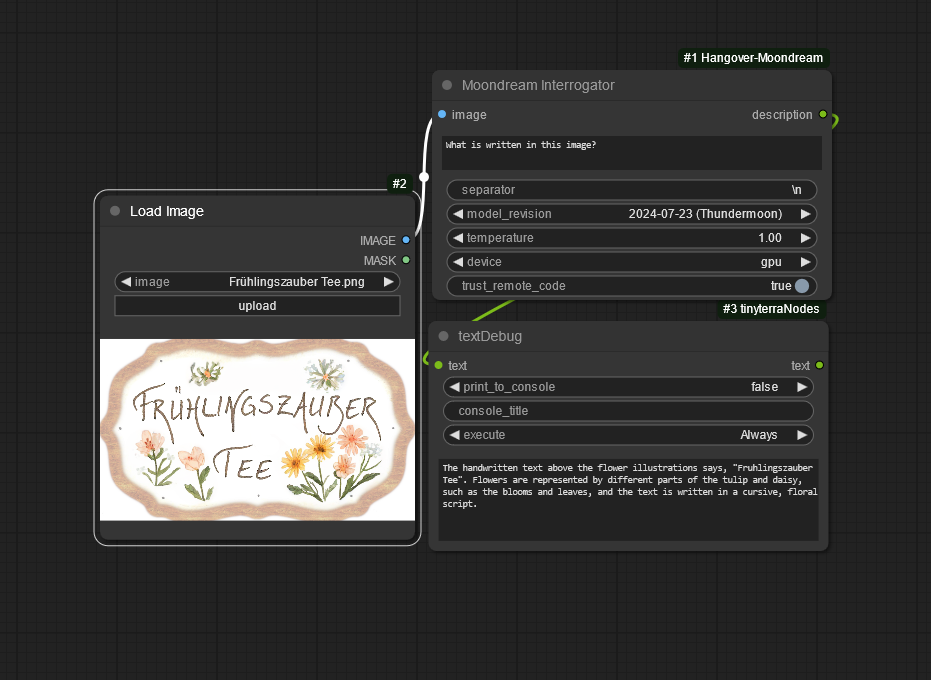
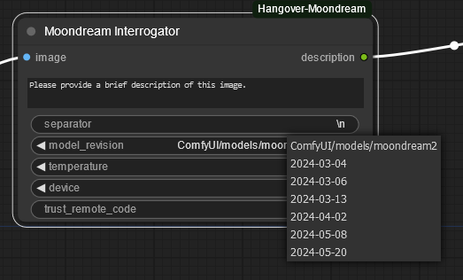

# ConfyUI-Hangover-Moondream

## This repository will no longer be maintained.

[Moondream](https://huggingface.co/vikhyatk/moondream2) is a lightweight multimodal large languge model.

⚠️ **WARNING: Additional python code will be downloaded from huggingface and executed. You have to trust this creator if you want to use this node!**

👍 For testing, research and fun.

Very impressive OCR capabilities in the 'Thundermoon' edition (version 2024-07-23):

## Updates

* Now passing proper prompt to the model 🐞
* Model/code update [moondream2](https://huggingface.co/vikhyatk/moondream2). This should resolve issues with the 'Tensor size mismatch' error when using newer versions of transformers.**Make sure that you select the moondream2 model within the node to receive the updated files from huggingface.** If moondream2 works fine, you can remove the old model files, usually located in the user\\.cache\huggingface folder: hub\models--vikhyatk--moondream1 and modules\transformers_modules\vikhyatk\moondream1 to save disk space.
* End support for moondream1 in order to change the license for this repository to [Apache 2.0](https://choosealicense.com/licenses/apache-2.0/).
* New multi prompt feature: Ask several questions at once. Just place each prompt on a new line.
* Added model revision selector.
* Added model temperature selector. Set this value to 0 to use the models default temperature.
* Now supporting custom model folder location for manually downloaded models. \
   \
  The following files are expected in ComfyUI/models/moondream2:
  - model.safetensors
  - config.json
  - tokenizer.json
  - tokenizer_config.json
  - generation_config.json
  - configuration_moondream.py
  - modeling_phi.py
  - moondream.py
  - vision_encoder.py
  - region_model.py 🔄
  - fourier_features.py 🔄
  - handler.py 🔄
* Handling  information for special model names 🔄
* The new models from 2025 needs the binaries from the [libvip](https://github.com/libvips/build-win64-mxe/releases) package in the search path of your OS. https://github.com/libvips/build-win64-mxe/releases/download/v8.16.0/vips-dev-w64-web-8.16.0-static.zip for Windows. Alternatively you can put "libvips-42.dll" from this package into the ComfyUI_windows_portable root folder.

## To do
