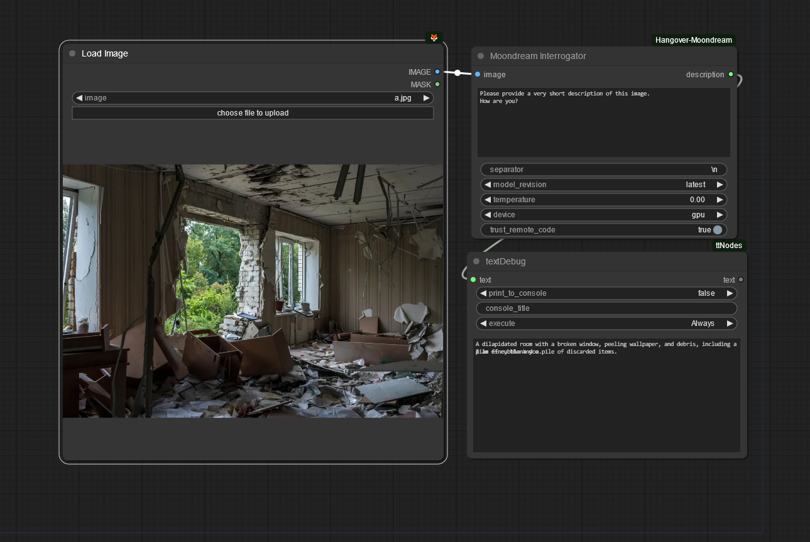

# ConfyUI-Hangover-Moondream

[Moondream](https://huggingface.co/vikhyatk/moondream2) is a lightweight multimodal large languge model.

⚠️ **WARNING: Additional python code will be downloaded from huggingface and executed. You have to trust this creator if you want to use this node!**

👍 For testing, research and fun.

## Updates

* Now passing proper prompt to the model 🐞
* Model/code update [moondream2](https://huggingface.co/vikhyatk/moondream2). This should resolve issues with the 'Tensor size mismatch' error when using newer versions of transformers.**Make sure that you select the moondream2 model within the node to receive the updated files from huggingface.** If moondream2 works fine, you can remove the old model files, usually located in the user\\.cache\huggingface folder: hub\models--vikhyatk--moondream1 and modules\transformers_modules\vikhyatk\moondream1 to save disk space.🔄
* End support for moondream1 in order to change the license for this repository to [Apache 2.0](https://choosealicense.com/licenses/apache-2.0/).
* New multi prompt feature: Ask several questions at once. Just place each prompt on a new line. 🔄
* Added model revision selector. 🔄
* Added model temerature selector. Set this value to 0 to use the models default temperature. 🔄

## To do
