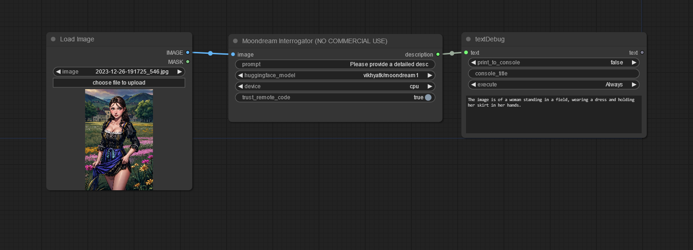

# ConfyUI-Hangover-Moondream
[Moondream](https://huggingface.co/vikhyatk/moondream1) is a lightweight multimodal large languge model

## Updates
  * Now passing proper prompt to the model 🐞

ℹ️ **IMPORTANT: According to the creator, Moondream is for research purposes only, commercial use is not allowed!**

⚠️ **WARNING: Additional python code will be downloaded from huggingface and executed. You have to trust this creator if you want to use this node!**

👍 For testing, research and fun. There might be issues when loading this node, and/or additional packages needs to be installed. It worked fine after I reinstalled the latest release of ComfyUI.

## To do
🔜