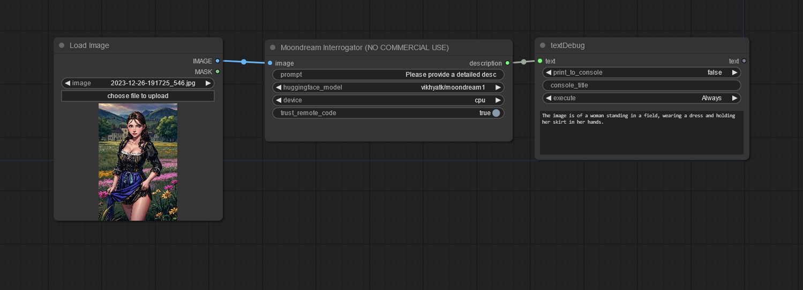

# ConfyUI-Hangover-Moondream

[Moondream](https://huggingface.co/vikhyatk/moondream1) is a lightweight multimodal large language model.

ℹ️ **IMPORTANT: According to the creator [vikhyatk](https://huggingface.co/vikhyatk), Moondream1 is for research purposes only and commercial use is not allowed!** [Moondream2](https://huggingface.co/vikhyatk/moondream2) does not have this limitations.

⚠️ **WARNING: Additional python code will be downloaded from huggingface and executed. You have to trust this creator if you want to use this node!**

👍 For testing, research and fun. There might be issues when loading this node, and/or additional packages needs to be installed. It worked fine after I reinstalled the latest release of ComfyUI.

## Custom model path

There is an input field to specify a custom model path. Leave this field empty for automatic model and code version management 'the huggingface way'. The files are then stored in a folder named '.cache' in the users home directory.
If you specify this path, the model and all additional corresponding files are then expected to be in that folder. For example, type in ``./ComfyUI/models/moondream2`` if the files are located in the ComfyUI/models/moondream2 folder. This way, you can do

``git clone https://huggingface.co/vikhyatk/moondream2/tree/main``

into the ComfyUI/models folder to download the files manually and then later do

``git pull``

inside the moondream2 folder to update.

## Updates

* Now passing proper prompt to the model 🐞
* Model/code update [moondream2](https://huggingface.co/vikhyatk/moondream2). This should resolve issues with the 'Tensor size mismatch' error when using newer versions of transformers. **Make sure that you select the moondream2 model within the node to receive the updated files from huggingface.** If moondream2 works fine, you can remove the old model files, usually located in the user\\.cache\huggingface folder: hub\models--vikhyatk--moondream1 and modules\transformers_modules\vikhyatk\moondream1 to save disk space.🔄
* Custom model path for manually downloadad (and managed) models.🔄

## To do

* End support for moondream1 in order to change the license for this repository to [Apache 2.0](https://choosealicense.com/licenses/apache-2.0/).